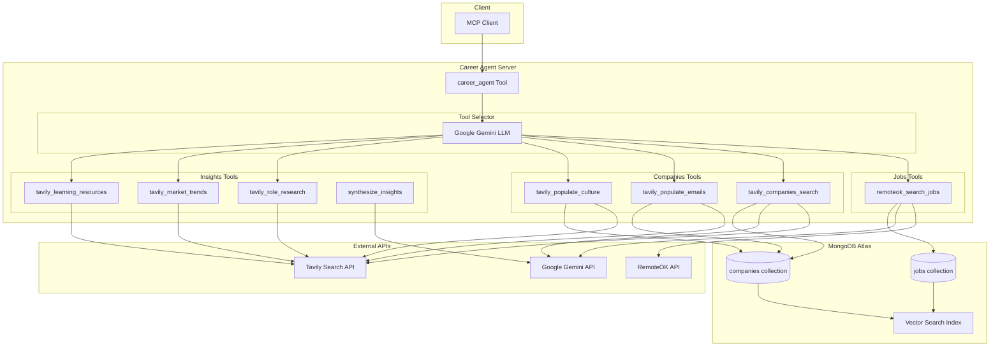

# Career Agent - MongoDB AI Hackathon

An intelligent career search agent that finds jobs, researches companies, and provides personalized career insights using MongoDB Atlas Vector Search and AI.

## Overview

Career Agent is an MCP (Model Context Protocol) server that helps users find relevant job opportunities and make informed career decisions. It combines:

- **Job Search**: Fetches jobs from RemoteOK API with semantic matching
- **Company Research**: Discovers companies and their culture using Tavily web search
- **Vector Search**: Uses MongoDB Atlas Vector Search for semantic similarity matching
- **AI Insights**: Generates personalized skill gap analysis and action plans

## Architecture



## Data Flow

1. **Query Processing**: User query is analyzed by an LLM to select appropriate tools
2. **Job Search**: RemoteOK API returns jobs, which are embedded using Google Gemini and stored in MongoDB
3. **Company Search**: Tavily finds relevant companies, generates embeddings, and stores them
4. **Vector Search**: MongoDB Atlas performs semantic search to find fresh matches and historical relevant results
5. **Culture/Email Enrichment**: Additional tools populate company culture and contact emails
6. **Insight Generation**: All collected data is synthesized into personalized recommendations

## Features

### Smart Tool Selection
The agent uses an LLM to dynamically select which tools to run based on the user's query. For example:
- "Find Python jobs" -> Jobs tools
- "Tell me about Google's engineering culture" -> Companies + Culture tools
- "What skills do I need for ML engineering?" -> Insights tools

### Vector Search with Fresh/Historical Mix
Results combine:
- **Fresh matches**: New results from the current query
- **Historical matches**: Semantically similar results from previous queries

This provides both relevance and serendipitous discovery.

### Personalized Insights
The synthesize_insights tool generates:
- Skill gap analysis comparing user skills to market demands
- Actionable steps with timelines and impact ratings
- Company culture fit recommendations

## API Reference

### career_agent

Main tool that orchestrates all functionality.

**Parameters:**
- `query` (str, required): Search query (e.g., "python developer remote")
- `allow_jobs` (bool, default: true): Enable job search tools
- `allow_companies` (bool, default: true): Enable company research tools
- `allow_insights` (bool, default: true): Enable insight generation tools
- `max_results` (int, default: 20): Maximum total results to return

**Response:**
```json
{
  "query": "python developer",
  "search_terms": ["python", "developer"],
  "jobs": [...],
  "companies": [...],
  "insights": {
    "tavily_role_research": {...},
    "tavily_market_trends": {...},
    "tavily_learning_resources": {...},
    "comprehensive": {
      "message": "Personalized career advice...",
      "skill_gaps": [...],
      "action_plan": [...]
    }
  },
  "metadata": {
    "execution_time_ms": 5432,
    "fresh_matches": 8,
    "historical_matches": 12,
    "tools_executed": [...]
  }
}
```

## Setup

### Prerequisites

- Python 3.11+
- MongoDB Atlas cluster with Vector Search enabled
- API keys for:
  - Google Gemini (embeddings and LLM)
  - Tavily (web search)

### Installation

1. Clone the repository:
```bash
git clone https://github.com/yourusername/career-agent.git
cd career-agent
```

2. Install dependencies:
```bash
uv sync
```

3. Configure secrets in `mcp_agent.secrets.yaml`:
```yaml
google:
  api_key: "your-gemini-api-key"

tavily:
  api_key: "your-tavily-api-key"

mongodb:
  connection_string: "mongodb+srv://..."
```

4. Create MongoDB Atlas Vector Search indexes:

**Jobs collection index** (`job_vector_index`):
```json
{
  "fields": [
    {
      "type": "vector",
      "path": "embedding",
      "numDimensions": 768,
      "similarity": "cosine"
    },
    {
      "type": "filter",
      "path": "url"
    }
  ]
}
```

**Companies collection index** (`company_vector_index`):
```json
{
  "fields": [
    {
      "type": "vector",
      "path": "embedding",
      "numDimensions": 768,
      "similarity": "cosine"
    },
    {
      "type": "filter",
      "path": "company_website_url"
    }
  ]
}
```

### Running Locally

```bash
uv run python main.py
```

### Deployment

Deploy to mcp-agent cloud:

```bash
uv run mcp-agent login
uv run mcp-agent deploy "career_agent" --no-auth
```

The server will be available at:
```
https://<server_id>.deployments.mcp-agent.com/sse
```

## Project Structure

```
career-agent/
├── main.py                          # Main app, tool registry, orchestration
├── config.py                        # Configuration helpers
├── models/
│   ├── job.py                       # Job data model
│   ├── company.py                   # Company data model
│   └── insights.py                  # Insights data models
├── tools/
│   ├── jobs/
│   │   └── remoteok_search_jobs.py  # Job search with embeddings
│   ├── companies/
│   │   ├── tavily_companies_search.py   # Company search with vector search
│   │   ├── tavily_populate_emails.py    # Email extraction
│   │   └── tavily_populate_culture.py   # Culture research
│   └── insights/
│       ├── tavily_role_research.py      # Role requirements research
│       ├── tavily_market_trends.py      # Market trends research
│       ├── tavily_learning_resources.py # Learning resources
│       └── synthesize_insights.py       # AI insight generation
├── mcp_agent.config.yaml            # MCP agent configuration
└── mcp_agent.secrets.yaml           # API keys (not committed)
```

## Technologies Used

- **mcp-agent**: MCP server framework for building AI agents
- **MongoDB Atlas**: Database with Vector Search for semantic matching
- **Google Gemini**: Embeddings (text-embedding-004) and LLM
- **Tavily**: Web search API for real-time information
- **RemoteOK**: Job listings API
- **Pydantic**: Data validation and serialization

## How It Works

### Embedding Generation
Jobs and companies are embedded using Google's text-embedding-004 model (768 dimensions). The embedding text includes:
- Jobs: title, company, location, tags, description snippet
- Companies: company name, website URL, culture description

### Vector Search Strategy
MongoDB Atlas Vector Search uses cosine similarity to find semantically similar documents. The system:
1. Generates a query embedding
2. Searches for fresh matches (documents from current query)
3. Searches for historical matches (documents NOT from current query)
4. Combines results for diversity

### Tool Chaining
When `tavily_companies_search` runs, it automatically triggers `tavily_populate_culture` to enrich the results with company culture data, which is then used by `synthesize_insights` for better recommendations.

## Acknowledgments

Built for the MongoDB AI Hackathon using:
- MongoDB Atlas Vector Search
- mcp-agent framework by LastMile AI
- Google Gemini API
- Tavily Search API
